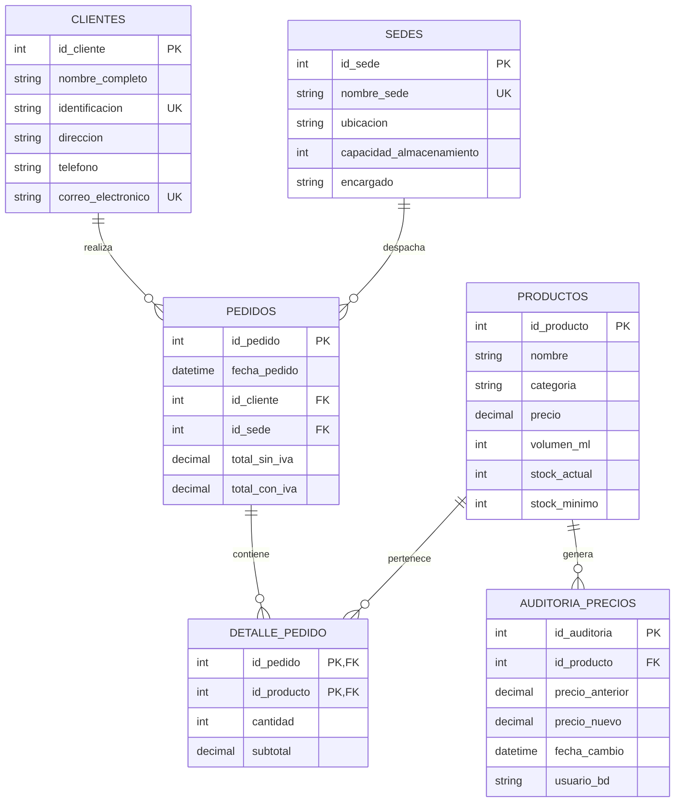

# Proyecto final - Gaseosas del Valle S.A.

## 1) Descripción del proyecto

Gaseosas del Valle S.A. es una empresa distribuidora autorizada de bebidas gaseosas en el municipio de Girón, con proyección de expansión hacia Bucaramanga y Piedecuesta. Actualmente la operación se apoya en hojas de cálculo para registrar pedidos y controlar el stock, lo que ha provocado errores manuales, inconsistencias y baja trazabilidad.

La solución propuesta consiste en una **base de datos relacional en MySQL 8.0+** para administrar:

- **Productos**
- **Clientes**
- **Sedes de distribución**
- **Pedidos**
- **Detalle de pedidos**
- **Auditoría de cambios de precio**

Además, el sistema incorpora funciones, triggers, vistas y consultas analíticas para mejorar el control operativo y apoyar la toma de decisiones comerciales y logísticas.

---

## 2) Objetivo general

Diseñar e implementar una base de datos relacional en MySQL que soporte la gestión integral de productos, clientes, pedidos y sedes de la empresa, incluyendo funciones, triggers, vistas y consultas analíticas para apoyar la toma de decisiones comerciales y logísticas.

### Objetivos específicos

1. Modelar correctamente las entidades del sistema y sus relaciones.
2. Automatizar cálculos como el IVA y la validación de stock.
3. Asegurar la integridad de la información mediante triggers.
4. Registrar auditorías cuando cambie el precio de un producto.
5. Construir consultas SQL con `JOIN`, `LIKE`, `IN`, `BETWEEN` y subconsultas.
6. Consolidar información mediante vistas para ventas y stock.
7. Entregar documentación técnica y evidencias de ejecución.

---

## 3) Archivos entregados

- `database.sql` → creación de base de datos, tablas, restricciones, índices y relaciones.
- `functions.sql` → funciones personalizadas.
- `triggers.sql` → triggers para validación, descuento de stock y auditoría.
- `views_and_queries.sql` → vistas y consultas analíticas.
- `sample_data.sql` → datos de prueba para evidencias y capturas.
- `erd_gaseosas_del_valle.svg` → diagrama entidad–relación exportado.
- `erd_gaseosas_del_valle.dot` → fuente del diagrama.

---

## 4) Modelo entidad–relación

### Diagrama ER (Mermaid)



### Explicación del modelo

- **Un cliente** puede realizar **muchos pedidos**.
- **Una sede** puede despachar **muchos pedidos**.
- **Un pedido** puede tener **muchos productos**.
- **Un producto** puede aparecer en **muchos pedidos**.
- La relación entre pedidos y productos se resuelve mediante la tabla intermedia **detalle_pedido**.
- Cada vez que cambia el precio de un producto, se registra un histórico en **auditoria_precios**.

---

## 5) Diccionario breve de tablas

### `productos`
Almacena el catálogo de bebidas y el control de stock.

Campos principales:
`id_producto`, `nombre`, `categoria`, `precio`, `volumen_ml`, `stock_actual`, `stock_minimo`

### `clientes`
Guarda la información básica de los compradores.

Campos principales:
`id_cliente`, `nombre_completo`, `identificacion`, `direccion`, `telefono`, `correo_electronico`

### `sedes`
Representa los puntos de distribución desde los que se despachan pedidos.

Campos principales:
`id_sede`, `nombre_sede`, `ubicacion`, `capacidad_almacenamiento`, `encargado`

### `pedidos`
Encabezado del pedido. Relaciona cliente, sede y totales.

Campos principales:
`id_pedido`, `fecha_pedido`, `id_cliente`, `id_sede`, `total_sin_iva`, `total_con_iva`

### `detalle_pedido`
Tabla intermedia para la relación N–N entre pedidos y productos.

Campos principales:
`id_pedido`, `id_producto`, `cantidad`, `subtotal`

### `auditoria_precios`
Guarda trazabilidad sobre cambios de precio en productos.

Campos principales:
`id_auditoria`, `id_producto`, `precio_anterior`, `precio_nuevo`, `fecha_cambio`, `usuario_bd`

---

## 6) Explicación de funciones

### `fn_calcular_total_con_iva(id_pedido)`
**Propósito:** calcular el total del pedido con IVA del 19%.

**Lógica:**
1. Suma los subtotales del pedido en `detalle_pedido`.
2. Aplica el factor `1.19`.
3. Retorna el total con dos decimales.

**Ejemplo:**
```sql
SELECT fn_calcular_total_con_iva(1) AS total_con_iva;
```

---

### `fn_validar_stock(id_producto, cantidad)`
**Propósito:** indicar si un producto tiene existencias suficientes antes de registrar un detalle de pedido.

**Lógica:**
1. Busca el stock actual del producto.
2. Compara el stock disponible con la cantidad solicitada.
3. Retorna un mensaje descriptivo.

**Ejemplo:**
```sql
SELECT fn_validar_stock(1, 10) AS validacion_stock;
```

---

## 7) Explicación de triggers

### `tr_validar_stock_detalle`
**Tipo:** `BEFORE INSERT` sobre `detalle_pedido`

**Función:**
- Verifica que la cantidad sea mayor que cero.
- Bloquea la fila del producto con `FOR UPDATE` para evitar inconsistencias de concurrencia.
- Rechaza el registro si no hay stock suficiente.
- Calcula el subtotal automáticamente con base en el precio actual del producto.

**Ventaja:** evita que se registren ventas imposibles y elimina errores manuales en el subtotal.

---

### `tr_actualizar_stock`
**Tipo:** `AFTER INSERT` sobre `detalle_pedido`

**Función:**
- Descuenta automáticamente el stock del producto vendido.
- Recalcula `total_sin_iva` del pedido.
- Recalcula `total_con_iva` usando la función `fn_calcular_total_con_iva`.

**Ventaja:** mantiene sincronizados inventario y facturación sin depender de procesos manuales.

---

### `tr_auditar_cambio_precio`
**Tipo:** `AFTER UPDATE` sobre `productos`

**Función:**
- Detecta cambios en el campo `precio`.
- Inserta un registro en `auditoria_precios` con precio anterior, precio nuevo, fecha y usuario de base de datos.

**Ventaja:** aporta trazabilidad y control histórico sobre cambios sensibles del negocio.

---

## 8) Vistas implementadas

### `vista_resumen_pedidos_por_sede`
Consolida número de pedidos y ventas acumuladas por sede.

### `vista_productos_bajo_stock`
Lista los productos cuyo `stock_actual <= stock_minimo`.

### `vista_clientes_activos`
Muestra los clientes que tienen al menos un pedido registrado.

---

## 9) Orden recomendado de ejecución

Ejecuta los scripts en este orden:

```sql
SOURCE database.sql;
SOURCE functions.sql;
SOURCE triggers.sql;
SOURCE sample_data.sql;
SOURCE views_and_queries.sql;
```

Si no vas a cargar datos de prueba, puedes omitir `sample_data.sql`.

**Nota técnica:** estos scripts fueron redactados para **MySQL 8.0+**. En algunos servidores con binary logging activado, la creación de funciones puede requerir permisos de administrador o la variable `log_bin_trust_function_creators = 1`.

---

## 10) Datos de prueba incluidos

El archivo `sample_data.sql` carga:

- 3 sedes
- 6 clientes
- 8 productos
- 5 pedidos
- 11 líneas de detalle
- 1 actualización de precio para probar auditoría

Esto permite ejecutar de inmediato todas las consultas exigidas y tomar capturas reales en MySQL Workbench o phpMyAdmin.

---

## 11) Ejemplos de consultas y resultados esperados

> Los siguientes resultados corresponden a la ejecución de `sample_data.sql`.

### 11.1 Productos con stock por debajo del mínimo

```sql
SELECT * FROM vista_productos_bajo_stock;
```

**Resultado esperado:**

| id_producto | nombre                | categoria | stock_actual | stock_minimo |
|---|---|---|---:|---:|
| 8 | Té frío limón 500 ml | Té | 14 | 20 |
| 4 | Lima Limón 300 ml | Gaseosa | 20 | 20 |

---

### 11.2 Pedidos realizados entre dos fechas

```sql
SELECT p.id_pedido, p.fecha_pedido, c.nombre_completo, s.nombre_sede, p.total_con_iva
FROM pedidos p
JOIN clientes c ON c.id_cliente = p.id_cliente
JOIN sedes s ON s.id_sede = p.id_sede
WHERE DATE(p.fecha_pedido) BETWEEN '2026-04-01' AND '2026-04-30';
```

**Resultado esperado:**

| id_pedido | fecha_pedido | cliente | sede | total_con_iva |
|---:|---|---|---|---:|
| 1 | 2026-04-01 09:10:00 | Supertienda Girón | Girón Centro | 55930.00 |
| 2 | 2026-04-03 14:30:00 | Minimercado San Juan | Girón Centro | 60095.00 |
| 3 | 2026-04-05 11:00:00 | Distribuciones La 27 | Bucaramanga Norte | 44744.00 |
| 4 | 2026-04-07 16:45:00 | Supertienda Girón | Piedecuesta Sur | 84966.00 |
| 5 | 2026-04-10 08:20:00 | Tienda El Puente | Bucaramanga Norte | 70805.00 |

---

### 11.3 Productos más vendidos

```sql
SELECT pr.nombre, SUM(dp.cantidad) AS unidades_vendidas
FROM detalle_pedido dp
JOIN productos pr ON pr.id_producto = dp.id_producto
GROUP BY pr.id_producto, pr.nombre
ORDER BY unidades_vendidas DESC;
```

**Resultado esperado (primeras filas):**

| nombre | unidades_vendidas |
|---|---:|
| Agua sin gas 600 ml | 26 |
| Cola 400 ml | 22 |
| Cola 1500 ml | 8 |
| Naranja 400 ml | 8 |

---

### 11.4 Clientes y cantidad de pedidos realizados

```sql
SELECT c.nombre_completo, COUNT(p.id_pedido) AS cantidad_pedidos
FROM clientes c
LEFT JOIN pedidos p ON p.id_cliente = c.id_cliente
GROUP BY c.id_cliente, c.nombre_completo
ORDER BY cantidad_pedidos DESC;
```

**Resultado esperado:**

| cliente | cantidad_pedidos |
|---|---:|
| Supertienda Girón | 2 |
| Distribuciones La 27 | 1 |
| Minimercado San Juan | 1 |
| Tienda El Puente | 1 |
| Autoservicio La Cumbre | 0 |
| Kiosco Portal | 0 |

---

### 11.5 Búsqueda de clientes por nombre parcial con `LIKE`

```sql
SELECT *
FROM clientes
WHERE nombre_completo LIKE '%tienda%';
```

**Resultado esperado:**

| id_cliente | nombre_completo |
|---:|---|
| 1 | Supertienda Girón |
| 4 | Tienda El Puente |

---

### 11.6 Productos por categorías con `IN`

```sql
SELECT nombre, categoria, stock_actual
FROM productos
WHERE categoria IN ('Gaseosa', 'Agua', 'Energizante');
```

**Resultado esperado:** lista de productos de esas tres categorías, excluyendo la categoría `Té`.

---

### 11.7 Cliente con mayor número de pedidos

```sql
SELECT c.nombre_completo, t.total_pedidos
FROM clientes c
JOIN (
    SELECT id_cliente, COUNT(*) AS total_pedidos
    FROM pedidos
    GROUP BY id_cliente
) t ON t.id_cliente = c.id_cliente
WHERE t.total_pedidos = (
    SELECT MAX(sub.total_pedidos)
    FROM (
        SELECT COUNT(*) AS total_pedidos
        FROM pedidos
        GROUP BY id_cliente
    ) sub
);
```

**Resultado esperado:**

| cliente | total_pedidos |
|---|---:|
| Supertienda Girón | 2 |

---

### 11.8 Pedidos y totales agrupados por sede

```sql
SELECT *
FROM vista_resumen_pedidos_por_sede;
```

**Resultado esperado:**

| sede | cantidad_pedidos | ventas_sin_iva | ventas_con_iva |
|---|---:|---:|---:|
| Girón Centro | 2 | 97500.00 | 116025.00 |
| Bucaramanga Norte | 2 | 97100.00 | 115549.00 |
| Piedecuesta Sur | 1 | 71400.00 | 84966.00 |

---

### 11.9 Evidencia de auditoría de precios

```sql
SELECT *
FROM auditoria_precios;
```

**Resultado esperado:**

| id_producto | precio_anterior | precio_nuevo |
|---:|---:|---:|
| 1 | 3500.00 | 3800.00 |

---

## 12) Recomendaciones para expansión futura del sistema

1. **Manejo de usuarios y roles** para diferenciar permisos de administrador, bodega, ventas y auditoría.
2. **Historial de movimientos de inventario** para registrar entradas, salidas, ajustes y devoluciones.
3. **Estados del pedido** como pendiente, despachado, entregado o cancelado.
4. **Módulo de facturación** con número de factura, método de pago y control de cartera.
5. **Tabla de proveedores y compras** para soportar reabastecimiento.
6. **Separar stock por sede** mediante una tabla `inventario_sede` cuando la operación crezca.
7. **Procedimientos almacenados** para registrar pedidos completos en una sola transacción.
8. **Dashboards de BI** conectados a Power BI o Looker Studio para análisis comercial.
9. **Alertas automáticas de reposición** cuando el stock llegue al mínimo.
10. **Particionamiento o archivado histórico** si el volumen de pedidos aumenta considerablemente.

---

## 13) Conclusión

La propuesta desarrollada cumple con los requerimientos funcionales del proyecto y resuelve los principales problemas del manejo manual en hojas de cálculo. La base de datos garantiza integridad, trazabilidad, automatización del cálculo de totales y control confiable del inventario, dejando preparada a la empresa para una expansión futura más ordenada.
